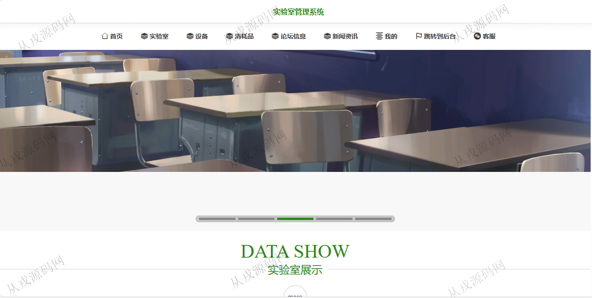
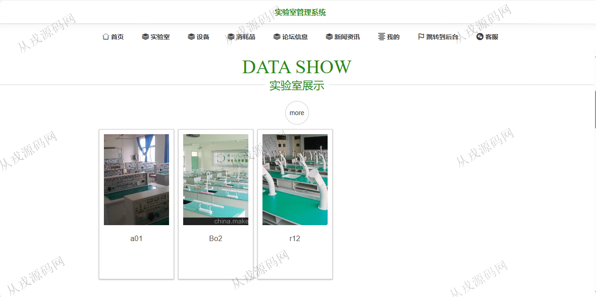
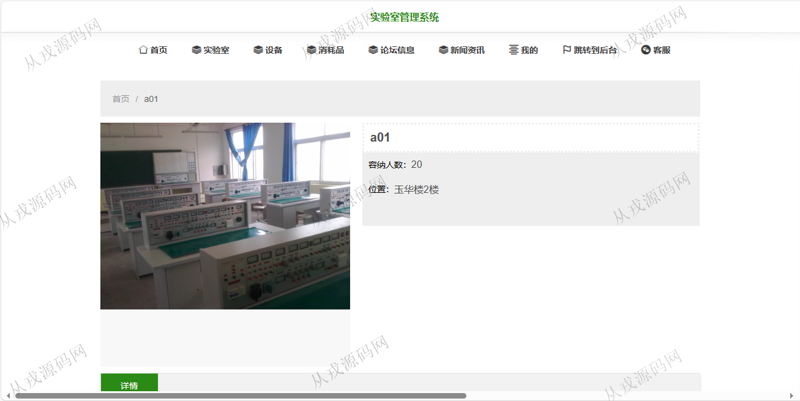
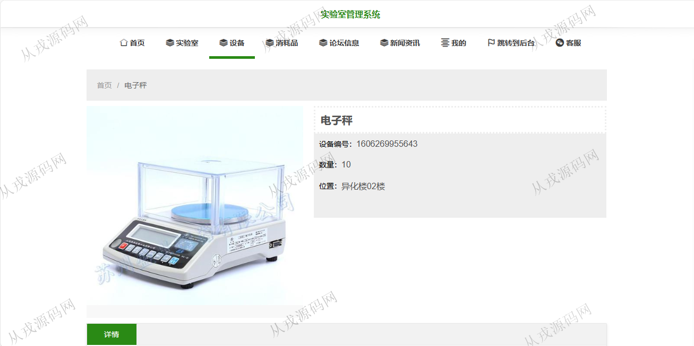
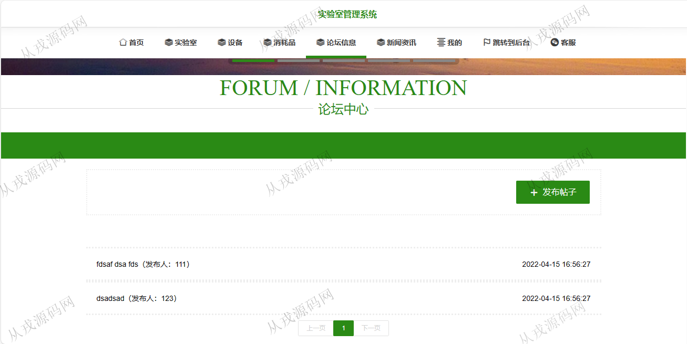
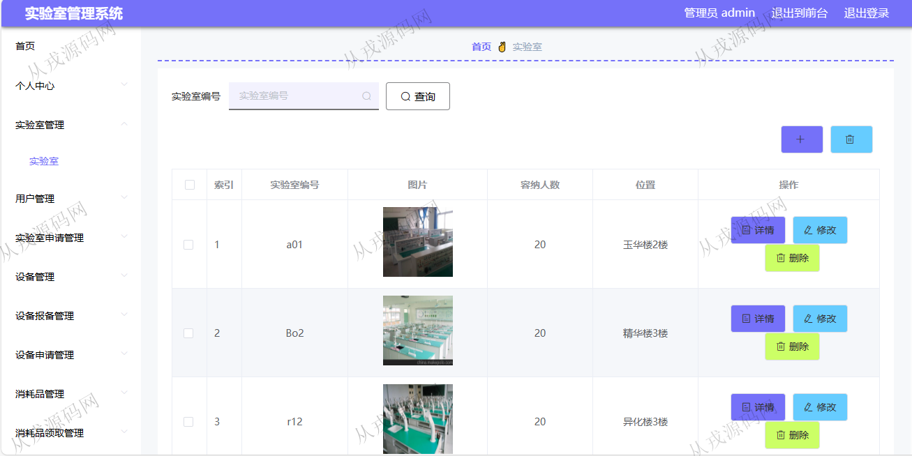
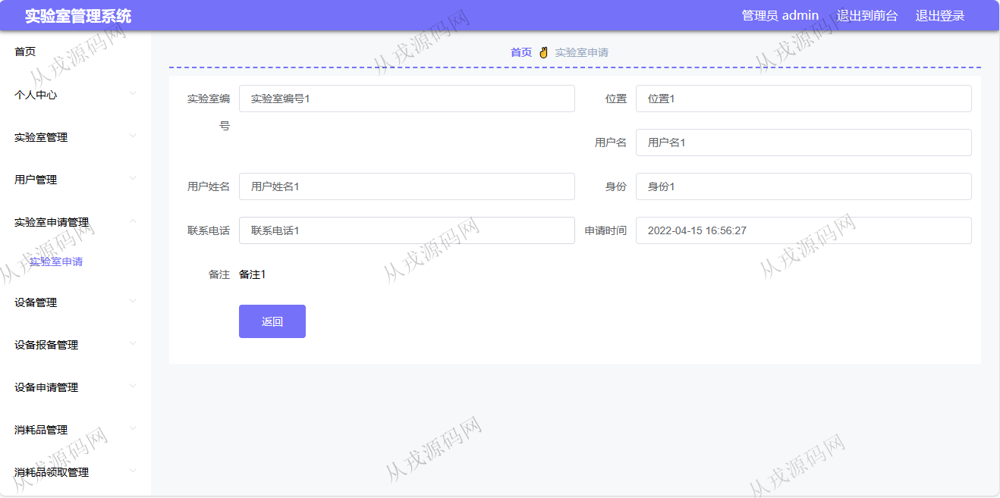
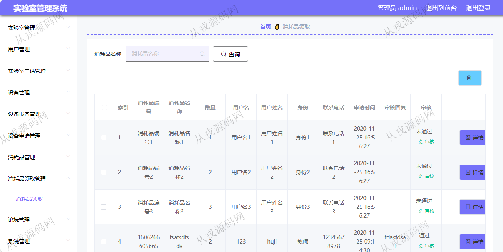

<h1 align="center">155.实验室管理系统</h1>

- <b>完整代码获取地址：从戎源码网 ([https://armycodes.com/](https://armycodes.com/))</b>
- <b>技术探讨、资料分享，请加QQ群：692619798</b> 
- <b>作者微信：19941326836  QQ：952045282</b> 
- <b>承接计算机毕业设计、Java毕业设计、Python毕业设计、深度学习、机器学习</b>
- <b>选题+开题报告+任务书+程序定制+安装调试+论文+答辩ppt 一条龙服务</b>
- <b>所有选题地址 ([https://github.com/YuLin-Coder/AllProjectCatalog](https://github.com/YuLin-Coder/AllProjectCatalog)) </b>

## 项目介绍
基于springboot+vue的实验室管理系统：前端 vue、element，后端 maven、springmvc、spring、mybatis；角色分为管理员、用户；集成实验室在线申请，设备申请，消耗品领取等功能于一体的系统。

## 功能介绍

### 用户

- 基本功能：登录，注册，退出
- 网站首页：主导航栏，轮播图，实验室展示，设备展示，消耗品展示，新闻资讯
- 实验室：实验室列表展示，按实验室编号搜索，实验室详情，实验室在线申请
- 设备：设备列表展示，设备搜索，设备详情，设备报备，设备在线领取
- 消耗品：消耗品列表展示，消耗品搜索，消耗品详情，在线领取消耗品
- 论坛信息：论坛信息列表展示，发布帖子
- 新闻资讯：新闻资讯展示，资讯详情查看
- 我的：个人信息的查看与修改，我的发布信息查看

### 管理员

- 实验室管理：实验室信息的增删改查，实验室图片上传
- 用户管理：用户信息的增删改查，用户信息主要由前台用户自行注册而来，管理员也可以添加用户信息
- 实验室申请管理：用户在前台申请实验室，管理员后台查看申请记录，审核
- 设备管理：设备信息的增删改查，设备详情信息支持富文本编辑
- 设备报备：报备信息的增删改查，审核操作
- 消耗品管理：消耗品信息的增删改查
- 消耗品领取管理：消耗品领取记录查询，审核操作
- 论坛管理：论坛帖子信息的增删改查，管理员查看用户发布的帖子
- 系统管理：轮播图管理（对应网站首页轮播图显示），新闻资讯，客服管理

## 环境

- <b>IntelliJ IDEA 2021.3</b>

- <b>Mysql 5.7.26</b>

- <b>Node 14.14.0</b>

- <b>JDK 1.8</b>

## 运行截图

